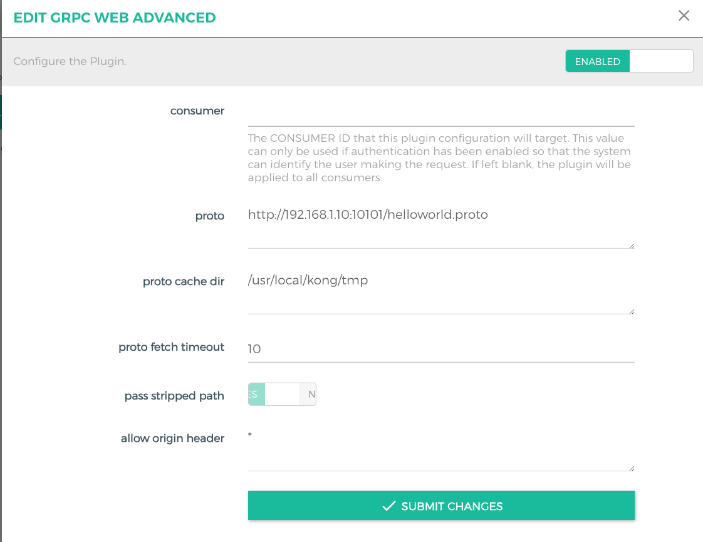
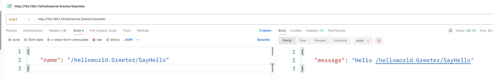

## kong 插件集合集成
可以挂载到kong route service consumer
## 支持插件
go-log：file-log的go语言实现版   
go-hello hello版本   
proxy-cache-advanced 代理缓存高级版(memory+redis+disk+腾讯云tcos+阿里云aoss策略)     
grpc-web-advanced grpc-web高级版本 浏览器可跨域http->grpc，可挂载远程proto文件   
grpc-gateway-advanced grpc-gateway高级版,可挂载远程proto文件   

## 构建镜像
sh docker-build.sh

## 效果
插件列表
   
**proxy-cache-advanced**
支持回源逻辑异步在queue处理，支持配置防缓存穿透开关+redis-lock策略
插件策略选择
   
postman测试Redis策略
   
redis-gui查看cache-key:result
   
插件API操作cache

**grpc-web-advanced**   
proto 文件支持配置http|https文件地址和本地目录文件   
proto_cache_dir proto缓存目录（若proto为远程文件则下载后缓存到该目录下）   

http-->grpc接入   

## 交流合作
可定制化kong网关插件开发   
1225807604@qq.com，flyingfish_vvip（wechat）

## 赞助列表