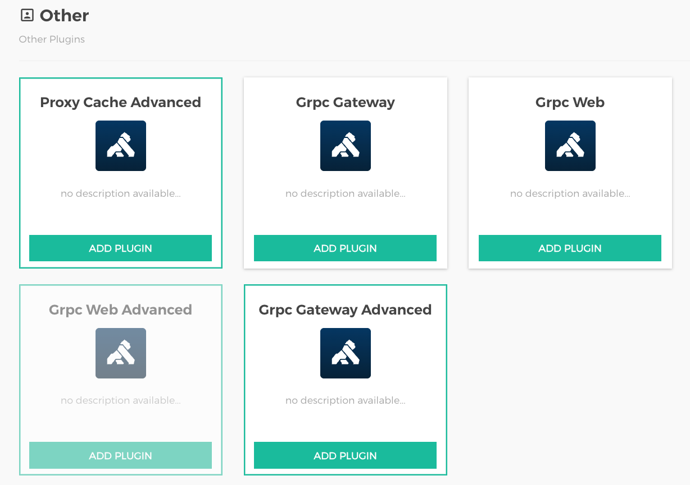
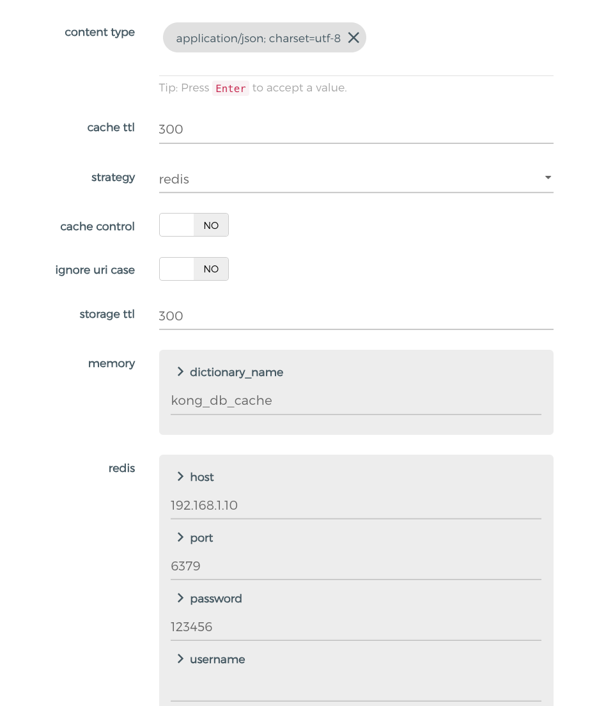
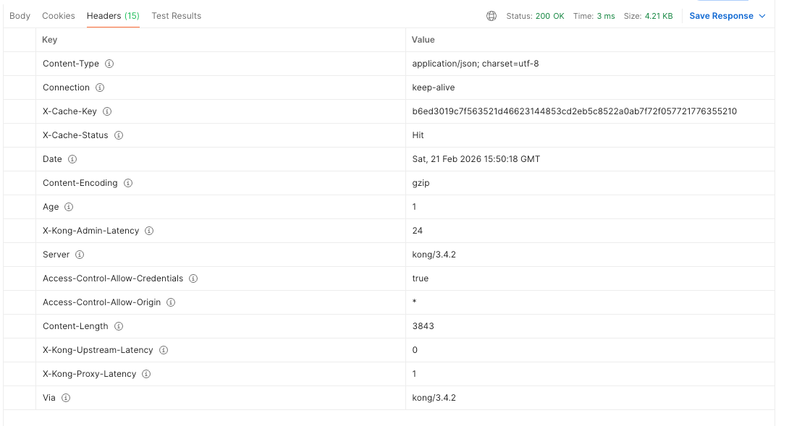
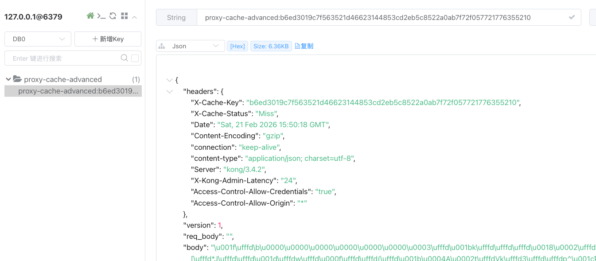
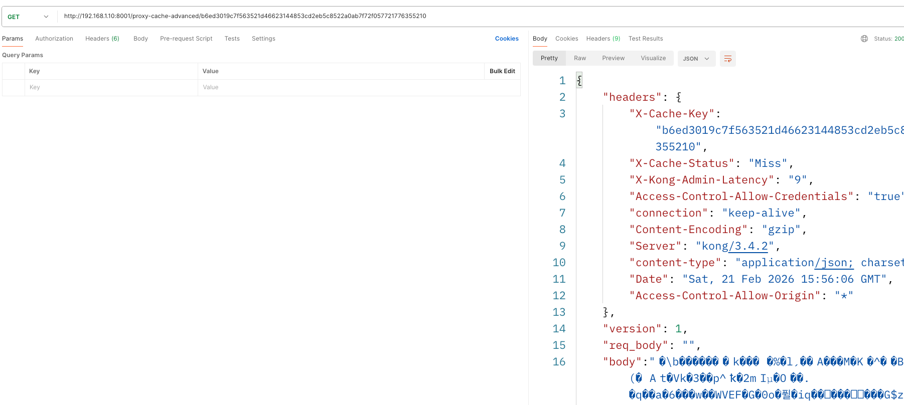

## kong 插件集合集成
可以挂载到kong route service consumer
## 支持插件
go-log：file-log的go语言实现版   
go-hello hello版本   
proxy-cache-avanced 代理缓存高级版(memory+redis策略)   

## 构建镜像
sh docker-build.sh

## 效果
插件列表
   
插件策略选择
   
postman测试Redis策略
   
redis-gui查看cache-key:result
   
插件API操作cache

## 交流合作
可定制化kong网关插件开发   
1225807604@qq.com，flyingfish_vvip（wechat）